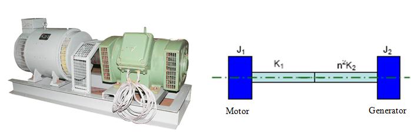

Analyzing real system as a single degree system is an approximate assumption. Because real system has more than just one degree of freedom and are also very rarely linear. It requires several degrees of freedom for a meaningful model. Hence a simple 1DOF systems analysis is not much helpful in studying the characteristics of the system. A natural extension of single degree of freedom system is to consider the system as two degree of freedom models. A System that requires two independent coordinates to describe their motion is called two degree-of-freedom systems. Some practical examples of two degree freedom systems are shown below, like as forging hammer anvil supported in its base, which in turn is supported on ground isolators, a reciprocating engine with a damper, a relatively light shaft with two disks as in a turbocharger rotor, a generator driving a motor through a coupling. For a two degree of freedom system there are two equations of motion, each one describing the motion of one of the degrees of freedom. In general, the two equations are in the form of coupled differential equations.

A simplified two degree of freedom system is shown below. The motion of the system is completely described by the coordinates and x1(t) and x2(t) which defines the positions of the masses m1 and m2 at any time t from the respective equilibrium positions. The external F1(t) and F2(t) respectively.

Equations of motion of 2 degree of freedom system are given by:

**Free vibration analysis**:

For the free-vibration analysis of the system shown above, if we set F1(t) = F2(t) =0. The equations above reduce to,

Let us assume the solutions for x1 and x2 under steady state conditions as harmonic excitations with the same frequency and phase angle but with different amplitudes and are given by,

By substituting the above solutions in equations of free vibration we have,

 = 0

Natural frequency of vibration of the system is found by solving these equations and is given by,

Resonance occurs when the exciting frequency coincides with any one of the natural frequency of the system.

**Forced vibration analysis**:  
In case of forced-vibration of the simplified 2DOF system shown above, the system could be excited by either of harmonic forcing functions F1(t) or F2(t) or both. But for the specific case, we assume the system is excited by harmonic force F1 (t) = F0 sin&omega;t. The equation of motion of the two degree freedom system reduces to,

When harmonic forcing function acts on the system, the solution consist of transient part and the steady state part. In steady state part the vibration of any point in the system take place at the frequency of excitation. Let us assume , for the steady state , the solution as,

Substituting this in equations of system under forced vibration we get,

By solving the above equations we get,

and

The above two equations give the steady state amplitude of vibration of two masses respectively as a function of forcing frequency &omega;.

